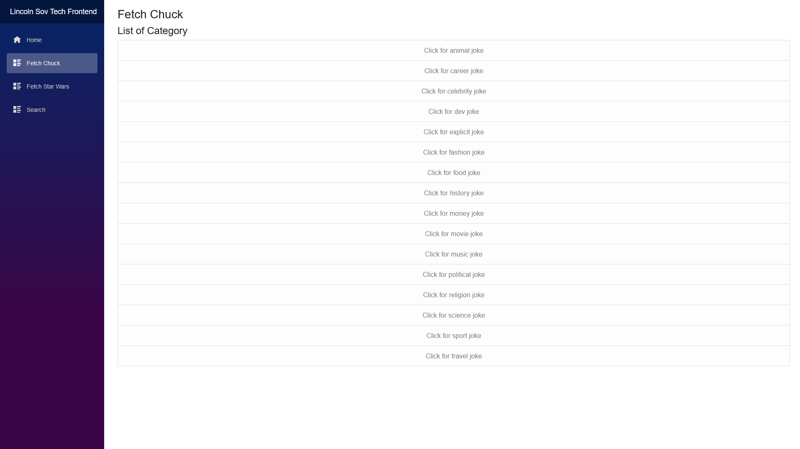
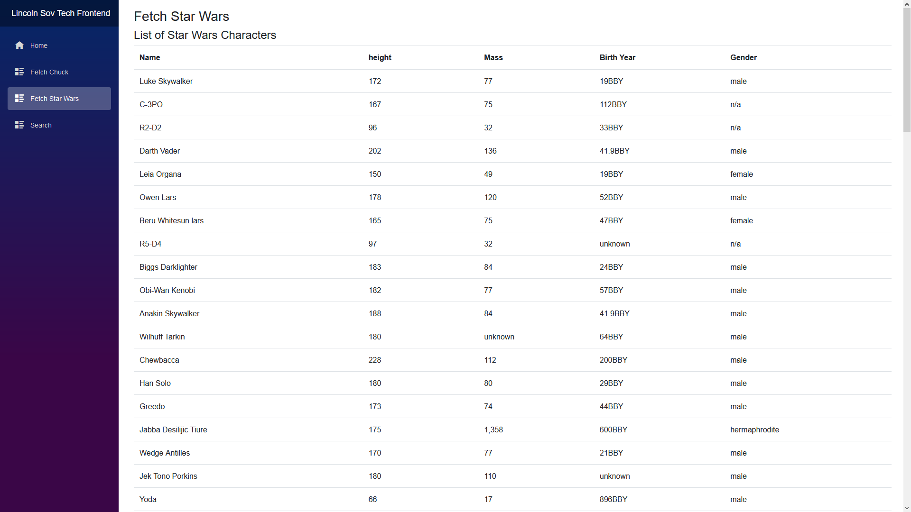
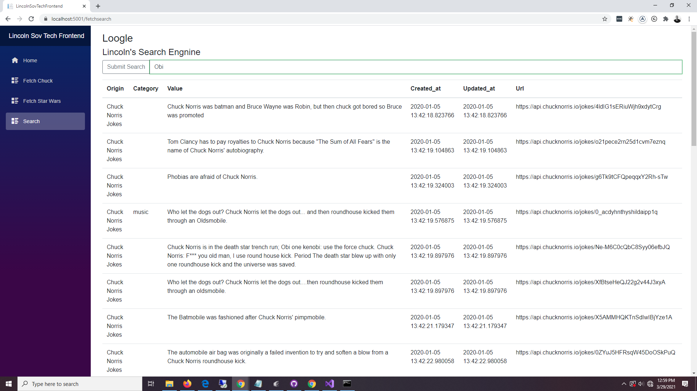

# LincolnSovTechFrontend
This uses an Implementation of an OpenAPI compliant web service that abstracts away two downstream APIs; the Chuck Norris API and the Star Wars API. It's the frontend side to the API.

Sadly No Heroku Instance (I struggled for a few hours but DotNet was being super finicky, I did get it to work but chose to move forward with local)

## Chuck NorrisScreen 

## Star Wars Screen 

## Search Screen 

# Usage

    Git Clone https://github.com/Lwachira/LincolnSovTechFrontend.git
    CD to LincolnSovTechFrontend
    dotnet restore (It should run on port 5001)
    dotnet run
    Fingers Crossed (Use the Heroku Instace instead)

## Tiny Caveats 

For security purposes I made the Backend API only accept from a handful of 
address (CORS is annoying), which are :
- "https://localhost:44367"
- "https://localhost:5001"
- "https://localhost:44387"

You may need to change the ssl port in the launchSettings.json Which can be found 
in Properties (LincolnSovTechFrontend\Properties)